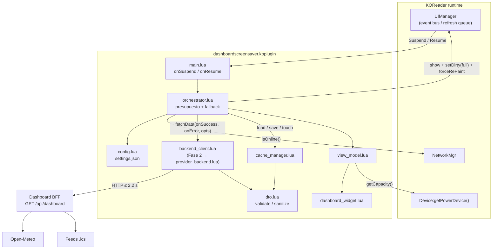
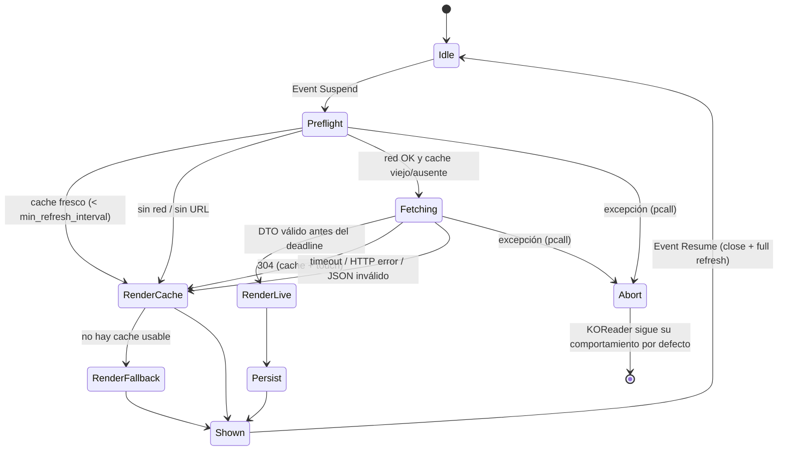
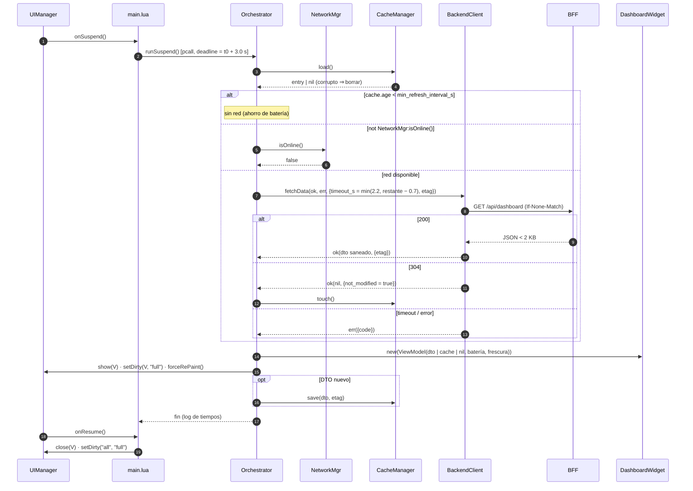

## Context

Proyecto nuevo (ver `proposal.md`, Why). Restricciones que dan forma al diseño:

- **KOReader en Kindle** ejecuta Lua 5.1/LuaJIT en un solo hilo. LuaSocket es bloqueante, así que toda E/S de red en la suspensión bloquea el hilo de la UI y debe acotarse con `socketutil`.
- **La suspensión tiene una ventana corta.** El sistema operativo duerme el dispositivo poco después del evento de suspensión, y lo que no esté pintado en ese momento no se verá. Presupuesto acordado: 3.0 s.
- **El reloj y la zona horaria del Kindle no son fiables** (derivan, a menudo UTC), así que "hoy" y las horas locales se calculan en el servidor.
- **La tinta electrónica** retiene restos de la imagen anterior (ghosting) si no se hace un refresco completo, y cada refresco consume energía.
- **KOReader tiene su propio módulo `Screensaver`**, que también pinta al suspender. El orden relativo con el evento `Suspend` de los plugins depende de la versión y se valida en el spike (tarea 1).

## Goals / Non-Goals

**Goals:**
- Arquitectura en la que la vista, el caché y el ciclo de vida no dependen del origen de los datos, para que las Fases 2 y 3 sean aditivas.
- p95 del handler de suspensión ≤ 1.0 s con el backend en LAN; máximo ≤ 3.0 s en cualquier fallo.
- Backend trivial de desplegar en una Raspberry Pi o un VPS (un contenedor, configurado por variables de entorno).

**Non-Goals:**
- Interfaz formal `DataProvider` y menú de ajustes completo (Fase 2).
- Modo standalone y parser iCal en Lua (Fase 3).
- Prefetch en segundo plano con el dispositivo despierto: queda en el backlog, salvo que el spike lo exija (ver Risks).
- i18n más allá del español, orientación horizontal optimizada, soporte oficial para Kobo y PocketBook.

## Decisions

### D1. Arquitectura por capas con el DTO como frontera



Regla de dependencias (verificada por un test, tarea 9.1): `dashboard_widget.lua`, `view_model.lua` y `cache_manager.lua` no pueden requerir módulos de red ni de proveedores.

**Arquitectura objetivo (Fase 3), como referencia:** `BackendClient` pasa a ser `BackendProvider`, se añade `DirectProvider` (Open-Meteo + `ICalParser`) detrás de la misma interfaz, y `ProviderFactory` los inyecta en el orquestador. Ninguna otra caja cambia.

*Alternativa descartada:* que la vista consuma directamente la respuesta del backend. Acopla la vista al formato del BFF y obliga a reescribirla en la Fase 3.

### D2. Integración con la suspensión: estrategia A con fallback a B

| Estrategia | Descripción | Pros | Contras |
|------------|-------------|------|---------|
| **A — `onSuspend` (preferida)** | El plugin (un `WidgetContainer` con `is_doc_only = false`) implementa `onSuspend` y muestra su widget. Requiere `screensaver_type = "disable"` en KOReader. | API pública | Depende del orden de eventos; el usuario cambia un ajuste |
| **B — Envolver `Screensaver.show`** | Guardar la función original y reemplazarla por un wrapper que pinta el dashboard; ante error o `enabled = false`, llama a la original. | Momento de pintado determinista; fallback natural | Acoplamiento a una API interna |

La decisión final la toma el spike (tarea 1.1, pregunta Q1). Ambas ramas comparten el orquestador; sólo cambia el punto de enganche en `main.lua`. `onSuspend` MUST NOT devolver `true`, para no consumir el evento que necesitan otros plugins (p. ej. AutoSuspend).

### D3. Ciclo de vida y degradación





**Algoritmo normativo de `runSuspend`:**

```
t0 ← time.now(); deadline ← t0 + 3000 ms
if not cfg.enabled then return end
entry ← cache:load()
should, reason ← shouldFetch(entry, os.time(), cfg.cache, NetworkMgr:isOnline(), cfg.backend.url)
if should then
    budget ← min(cfg.backend.total_timeout_s, remaining(deadline) − 0.7)
    if budget < 0.5 then err ← E_BUDGET_EXCEEDED
    else client:fetchData(onSuccess, onError, { timeout_s = budget, etag = entry and entry.etag })
end
if meta.not_modified then cache:touch() end
vm ← ViewModelBuilder.build(dto or entry.dto or nil, readDevice(), freshness(...), cfg.display)
widget ← DashboardWidget:new{ view_model = vm }
[anti_ghosting = "double" ⇒ pintar negro full + forceRePaint]
UIManager:show(widget); UIManager:setDirty(widget, "full"); UIManager:forceRePaint()
if dto then cache:save(dto, meta.etag, "backend") end
log de tiempos (si debug.log_timings)
```

### D4. Presupuesto temporal

| Etapa | Objetivo p95 | Tope | Control |
|-------|--------------|------|---------|
| Config (cargada en `init`) | 0 ms | — | Sin E/S en el camino de suspensión |
| `cache:load()` (≤ 4 KB) | 15 ms | 80 ms | Archivo pequeño |
| `NetworkMgr:isOnline()` | 5 ms | 50 ms | Sin ping ni DNS |
| Connect TCP (LAN) | 20 ms | **1.0 s** | `socketutil:set_timeout` + `create = socketutil.tcp` |
| Request + respuesta | 150 ms | **2.2 s** (tope 2.5) | `socketutil.table_sink` corta por tiempo total |
| Decode + validate + sanitize | 10 ms | 50 ms | Límite de 8 KB en el sink |
| Árbol de widgets | 60 ms | 150 ms | `Font:getFace` cacheado; PNG pequeños |
| Paint + refresco GC16 | 350 ms | 500 ms | `setDirty(full)` + `forceRePaint()` |
| `cache:save()` | 10 ms | 50 ms | Después del paint |
| **Total** | **~620 ms** | **3.0 s** | Deadline propagado |

Un solo intento de red por suspensión, sin reintentos. Se recomienda poner una IP en `backend.url` para evitar la resolución DNS.

### D5. Refresco E-Ink por la cola de UIManager

Se usa `UIManager:setDirty(widget, "full")` + `UIManager:forceRePaint()` en lugar de `Screen:refreshFull()` directo. Es equivalente (refresco completo con flash), pero garantiza que el framebuffer se escriba **y** se refresque de forma síncrona antes de que termine el handler, en el orden correcto con otros widgets. `Screen:refreshFull()` queda como fallback si el spike (Q3) muestra que el pintado no se completa antes de dormir.

### D6. Backend: Python + FastAPI con snapshot en memoria

- **Stack:** Python 3.12, FastAPI, httpx, `icalendar` + `recurring-ical-events` (RRULE, EXDATE, RECURRENCE-ID, TZID) y Pydantic v2 (fuente de verdad del schema).
- **Snapshot:** refreshers asíncronos en el `lifespan` (clima cada 900 s, ICS cada 300 s, rebuild cada minuto si cambió el día o terminó un evento). El handler sólo devuelve bytes y un ETag precalculados, con lo que el p95 queda por debajo de 50 ms sin importar los upstreams.
- *Alternativas descartadas:* Node + node-ical (soporte irregular de RRULE con TZID) y Go (golang-ical + rrule-go: más código propio para las recurrencias). El rendimiento no es un criterio porque el endpoint sirve desde memoria.

Módulos:

```python
# app/models.py      — HourlySlot, Weather, CalendarEvent, DashboardDTO (Pydantic v2)
# app/wmo.py         — (code, is_day) -> (icon, desc)
# app/adapters/weather_openmeteo.py
class OpenMeteoAdapter:
    async def fetch(self) -> WeatherSnapshot: ...
# app/adapters/calendar_ics.py
class IcsCalendarAdapter:
    async def fetch(self) -> list[RawCalendar]: ...     # feeds en paralelo, timeout 10 s c/u
    def events_for_day(self, cals, day, tz, now) -> list[CalendarEvent]: ...
# app/snapshot.py
class SnapshotStore:
    def get(self, max_events: int) -> tuple[bytes, str] | None: ...   # (body, etag)
    async def run_refreshers(self) -> None: ...
    def rebuild(self, now: datetime) -> None: ...        # ensambla, recorta ≤ 2048 B, serializa, etag
# app/main.py        — GET /api/dashboard, GET /healthz
```

Variables de entorno: `DASH_TOKEN`, `DASH_TZ` (`America/Santiago`), `DASH_LAT`, `DASH_LON`, `DASH_LOCATION_NAME`, `DASH_ICS_URLS` (separadas por coma), `DASH_WEATHER_REFRESH_S=900`, `DASH_CALENDAR_REFRESH_S=300`, `DASH_MAX_EVENTS=8` y `DASH_PORT=8080`.

Serialización: `json.dumps(dto, separators=(",", ":"), ensure_ascii=False).encode("utf-8")`; `etag = 'W/"' + sha1(body)[:12] + '"'`. Sin GZipMiddleware. Token comparado con `hmac.compare_digest`.

Petición a Open-Meteo:
`/v1/forecast?latitude=..&longitude=..&current=temperature_2m,apparent_temperature,relative_humidity_2m,weather_code,wind_speed_10m,is_day&hourly=temperature_2m,weather_code,precipitation_probability&daily=temperature_2m_max,temperature_2m_min,precipitation_probability_max,sunrise,sunset&timezone=<DASH_TZ>&forecast_days=2`

### D7. DTO con horas locales ya formateadas

El DTO lleva `date`, `weekday` y `start`/`end` como `"HH:MM"` en la zona del servidor, además de epoch para ordenar. El cliente no hace aritmética de fechas ni depende de la zona horaria del Kindle. *Descartado:* enviar sólo epoch UTC (obliga a tener tz en el Kindle).

### D8. Sin compresión, con ETag

El payload cabe en < 2 KB y LuaSocket no descomprime de forma transparente. El ETag/304 ahorra bytes y el decode en el caso común (nada cambió).

### D9. HTTP en LAN por defecto

El handshake TLS en un Kindle antiguo cuesta entre 0.5 y 1.5 s (el spike lo mide en Q5). Con el backend sólo en la LAN y un token de baja sensibilidad (lectura de clima y agenda), HTTP es aceptable. Si el backend se expone a Internet: HTTPS, o mejor una VPN (WireGuard/Tailscale) sobre HTTP.

### D10. Módulos del plugin (Fase 1)

```
plugin/dashboardscreensaver.koplugin/
├── _meta.lua
├── main.lua                     # DashboardScreensaver (WidgetContainer)
├── dashboard/
│   ├── orchestrator.lua         # SuspendOrchestrator
│   ├── backend_client.lua       # Fase 2 → provider_backend.lua
│   ├── cache_manager.lua
│   ├── config.lua               # ConfigStore
│   ├── dto.lua
│   ├── view_model.lua
│   ├── dashboard_widget.lua
│   └── format_es.lua
├── icons/                       # <icon>_96.png, <icon>_48.png
└── spec/                        # tests busted
```

Los módulos van en `dashboard/` y se cargan con `require("dashboard/x")`, porque KOReader añade la raíz del plugin a `package.path`.

**Errores como valores:**

```lua
---@alias ErrorCode "E_NOT_CONFIGURED"|"E_NO_NETWORK"|"E_TIMEOUT"|"E_TLS"|"E_AUTH"|"E_HTTP_STATUS"
---| "E_PAYLOAD_TOO_LARGE"|"E_JSON_PARSE"|"E_SCHEMA"|"E_BUDGET_EXCEEDED"|"E_CACHE_CORRUPT"|"E_INTERNAL"

---@class ProviderError
---@field code ErrorCode
---@field message string        -- sin secretos
---@field http_status integer|nil
---@field elapsed_ms integer
---@field retryable boolean     -- TIMEOUT, NO_NETWORK, 5xx
```

**`backend_client.lua`** — ya expone la firma de la futura interfaz `DataProvider`, para que la Fase 2 sea un renombre:

```lua
---@class FetchOpts
---@field timeout_s number
---@field etag string|nil
---@class FetchMeta
---@field etag string|nil
---@field not_modified boolean|nil
---@field elapsed_ms integer

--- Contrato: invoca EXACTAMENTE un callback, una sola vez; síncrono; termina antes de timeout_s + 100 ms;
--- entrega el DTO ya validado y saneado; no escribe el caché.
---@param onSuccess fun(dto: DashboardDTO|nil, meta: FetchMeta)
---@param onError fun(err: ProviderError)
---@param opts FetchOpts
function BackendClient:fetchData(onSuccess, onError, opts) end
```

Implementación de referencia:

```lua
local http, ltn12, socket = require("socket.http"), require("ltn12"), require("socket")
local socketutil, json = require("socketutil"), require("json")

function BackendClient:fetchData(onSuccess, onError, opts)
    local sink = {}
    local headers = { ["Accept"] = "application/json", ["Connection"] = "close" }
    if self.token ~= "" then headers["Authorization"] = "Bearer " .. self.token end
    if opts.etag then headers["If-None-Match"] = opts.etag end
    socketutil:set_timeout(self.connect_timeout_s, opts.timeout_s)
    local ok, code, resp_headers = pcall(function()
        return socket.skip(1, http.request{
            url = self.url .. "?max_events=" .. self.max_events, method = "GET", headers = headers,
            sink = ltn12.sink.chain(limitFilter(8192), socketutil.table_sink(sink)),
            create = socketutil.tcp,
        })
    end)
    socketutil:reset_timeout()                 -- SIEMPRE
    -- not ok → E_INTERNAL · TIMEOUT_CODE/SINK_TIMEOUT_CODE → E_TIMEOUT · SSL_HANDSHAKE_CODE → E_TLS
    -- 304 → onSuccess(nil, {not_modified=true}) · 401/403 → E_AUTH · ≠200 → E_HTTP_STATUS
    -- límite → E_PAYLOAD_TOO_LARGE · content-type ≠ application/json → E_JSON_PARSE
    -- pcall(json.decode) falla → E_JSON_PARSE · dto.validate falla → E_SCHEMA
    -- OK → onSuccess(dto.sanitize(t, display), { etag = resp_headers.etag })
end
```

**Resto de firmas:**

```lua
-- orchestrator.lua
function SuspendOrchestrator.new(deps) end                 -- {config, client, cache, clock?}
function SuspendOrchestrator:runSuspend() end
function SuspendOrchestrator.shouldFetch(entry, now, cache_cfg, online, url) end  --> bool, ErrorCode|nil (pura)
function SuspendOrchestrator:dismiss() end
function SuspendOrchestrator:runInteractive(opts) end      -- {force_fetch, show}; sin presupuesto de 3 s

-- cache_manager.lua
function CacheManager.new(opts) end                        -- {path?, fs?}
function CacheManager:load() end                           --> CacheEntry|nil (corrupto ⇒ borrar)
function CacheManager:save(dto, etag, provider_id) end     -- .tmp + os.rename
function CacheManager:touch() end                          -- sólo validated_at
function CacheManager.freshness(entry, now, cache_cfg, today) end  --> Freshness
function CacheManager:clear() end

-- dto.lua
function DTO.validate(t) end                               --> ok, err_path
function DTO.sanitize(t, display) end                      --> DashboardDTO (nunca falla)
function DTO.truncateUtf8(s, max_chars) end

-- config.lua
function ConfigStore.new(path) end
function ConfigStore:load() end                            -- defaults + merge profundo + clamp
function ConfigStore:get(dotted_key) end

-- view_model.lua / format_es.lua
function ViewModelBuilder.build(dto, device, freshness, display) end  --> ViewModel
function ViewModelBuilder.readDevice() end                 -- pcall(powerd:getCapacity / isCharging)
-- format_es: weekdayName, monthName, dateTitle, ageLabel ("hace 5 min" / "hace 2 h" / "hace 1 día")
```

```lua
---@class ViewModel
---@field header { title: string, subtitle: string }
---@field weather nil|{ temp: string, icon_path: string, desc: string, range: string, extra: string,
---                     hourly: { time: string, temp: string, icon_path: string }[] }
---@field weather_placeholder string|nil     -- "Clima no disponible"
---@field agenda { rows: { time: string, title: string, sub: string|nil }[], more: string|nil }
---@field agenda_placeholder string|nil      -- "Sin eventos hoy" | "Agenda no disponible" | "Agenda desactualizada"
---@field footer { left: string, right: string, warn: boolean }
```

### D11. Árbol de widgets

```
DashboardWidget (WidgetContainer, covers_fullscreen = true, dimen = pantalla)
└── FrameContainer  (background = COLOR_WHITE, bordersize = 0, padding = Size.padding.large ×2)
    └── VerticalGroup (align = "left")
        ├── Header      VerticalGroup{ TextWidget title (tfont 30, bold), TextWidget subtitle (cfont 18) }   ~12 %
        ├── LineWidget  (Size.line.thick, ≥ 2 px)
        ├── Weather     HorizontalGroup{ ImageWidget 96 px, VerticalGroup{temp (tfont 56 bold), desc, range·extra},
        │                                HorizontalSpan flexible, HorizontalGroup 4 × VerticalGroup{time, icon 48, temp} }  ~28 %
        │               (sin clima: CenterContainer > TextWidget placeholder)
        ├── LineWidget
        ├── Agenda      VerticalGroup{ TextWidget "Agenda de hoy", N × EventRow, TextWidget more }   resto
        │               EventRow = HorizontalGroup{ LeftContainer(w ≈ 26 %) > TextWidget time (bold),
        │                                           VerticalGroup{ TextWidget title (max_width, …), TextWidget sub } }
        └── Footer      OverlapGroup{ LeftContainer > TextWidget left, RightContainer > TextWidget right }   ~6 %
```

Todas las medidas pasan por `Screen:scaleBySize()` o son porcentajes del ancho o alto de la pantalla. Las filas se añaden mientras quepan; la que sobra se reemplaza por "+N más". El árbol se construye una vez por suspensión.

```
┌──────────────────────────────────────────────┐
│ Miércoles 23 de septiembre                   │
│ Santiago · Actualizado 13:40                 │
│━━━━━━━━━━━━━━━━━━━━━━━━━━━━━━━━━━━━━━━━━━━━━━│
│  ☁☀    18°              16:00 19:00 22:00 01:00│
│        Parcialmente      ☀     ☁☾    ☾    ☁  │
│        ↓9° ↑22° · 10%    21°   17°   13°  11° │
│━━━━━━━━━━━━━━━━━━━━━━━━━━━━━━━━━━━━━━━━━━━━━━│
│ Agenda de hoy                                │
│ Todo el día   Feriado bancario               │
│ 14:00–14:15   Stand-up equipo                │
│               Meet                           │
│ 18:30–19:30   Dentista                       │
│               Av. Providencia 1234           │
│                                              │
│ ● En vivo                        Batería 78% │
└──────────────────────────────────────────────┘
```

### D12. Matriz de errores (cliente)

| Código | Detección | Pantalla | Pie | ¿Borra caché? |
|--------|-----------|----------|-----|---------------|
| `E_NOT_CONFIGURED` | `backend.url == ""` | Caché → Mínima | "Configura el backend" | No |
| `E_NO_NETWORK` | `not NetworkMgr:isOnline()` | Caché → Mínima | "Sin conexión · hace X" | No |
| `E_BUDGET_EXCEEDED` | presupuesto < 0.5 s | Caché | "Sin conexión · hace X" | No |
| `E_TIMEOUT` | `TIMEOUT_CODE` / `SINK_TIMEOUT_CODE` | Caché | "Servidor lento · hace X" | No |
| `E_TLS` | `SSL_HANDSHAKE_CODE` | Caché | "Error TLS" | No |
| `E_AUTH` | 401 / 403 | Caché | "Token inválido" | No |
| `E_HTTP_STATUS` | otro status no exitoso | Caché | "Servidor HTTP 503" | No |
| `E_PAYLOAD_TOO_LARGE` | > 8192 bytes | Caché | "Respuesta inválida" | No |
| `E_JSON_PARSE` | tipo de contenido no JSON / decode falla | Caché | "Respuesta inválida" | No |
| `E_SCHEMA` | validate falla / `v > 1` | Caché | "Versión incompatible" | No |
| `E_CACHE_CORRUPT` | el caché no parsea / no valida | Live → Mínima | — | **Sí** |
| `E_INTERNAL` | excepción capturada por `pcall` | Mínima → nada | — | No |

### D13. Contrato de datos: artefactos normativos

**Ejemplo de DTO v1** (≈ 1.3 KB minificado):

```json
{
  "v": 1, "source": "backend",
  "generated_at": "2026-09-23T13:40:00-03:00", "generated_ts": 1790181600, "ttl_s": 900,
  "tz": "America/Santiago", "date": "2026-09-23", "weekday": 3,
  "weather": {
    "location": "Santiago", "temp": 18, "feels_like": 17, "t_min": 9, "t_max": 22,
    "code": 2, "icon": "partly_cloudy_day", "desc": "Parcialmente nublado",
    "pop": 10, "humidity": 45, "wind_kmh": 12, "sunrise": "07:12", "sunset": "19:31",
    "hourly": [
      { "time": "16:00", "temp": 21, "icon": "clear_day", "pop": 0 },
      { "time": "19:00", "temp": 17, "icon": "partly_cloudy_night", "pop": 5 },
      { "time": "22:00", "temp": 13, "icon": "clear_night", "pop": 0 },
      { "time": "01:00", "temp": 11, "icon": "cloudy", "pop": 20 }
    ]
  },
  "events": [
    { "title": "Feriado bancario", "all_day": true, "start": null, "end": null, "start_ts": 1790132400, "end_ts": 1790218800, "location": null, "cal": "Feriados" },
    { "title": "Stand-up equipo", "all_day": false, "start": "14:00", "end": "14:15", "start_ts": 1790182800, "end_ts": 1790183700, "location": "Meet", "cal": "Trabajo" },
    { "title": "Dentista", "all_day": false, "start": "18:30", "end": "19:30", "start_ts": 1790199000, "end_ts": 1790202600, "location": "Av. Providencia 1234", "cal": "Personal" }
  ],
  "events_total": 3,
  "warnings": []
}
```

**JSON Schema (draft 2020-12)** — se copia a `backend/tests/schema/dashboard-v1.json` (tarea 3.7):

```json
{
  "$schema": "https://json-schema.org/draft/2020-12/schema",
  "$id": "https://koreader-dashboard.local/schemas/dashboard-v1.json",
  "$defs": {
    "hhmm": { "type": "string", "pattern": "^([01][0-9]|2[0-4]):[0-5][0-9]$" },
    "icon": { "enum": ["clear_day","clear_night","partly_cloudy_day","partly_cloudy_night","cloudy","fog","drizzle","rain","heavy_rain","snow","showers","thunderstorm","unknown"] },
    "temp": { "type": "integer", "minimum": -60, "maximum": 60 },
    "pct":  { "type": "integer", "minimum": 0, "maximum": 100 },
    "HourlySlot": {
      "type": "object", "required": ["time","temp","icon"],
      "properties": { "time": { "$ref": "#/$defs/hhmm" }, "temp": { "$ref": "#/$defs/temp" },
                      "icon": { "$ref": "#/$defs/icon" }, "pop": { "$ref": "#/$defs/pct" } }
    },
    "Weather": {
      "type": "object",
      "required": ["location","temp","feels_like","t_min","t_max","code","icon","desc","pop","hourly"],
      "properties": {
        "location": { "type": "string", "maxLength": 40 },
        "temp": { "$ref": "#/$defs/temp" }, "feels_like": { "$ref": "#/$defs/temp" },
        "t_min": { "$ref": "#/$defs/temp" }, "t_max": { "$ref": "#/$defs/temp" },
        "code": { "type": "integer", "minimum": 0, "maximum": 99 },
        "icon": { "$ref": "#/$defs/icon" }, "desc": { "type": "string", "maxLength": 32 },
        "pop": { "$ref": "#/$defs/pct" }, "humidity": { "$ref": "#/$defs/pct" },
        "wind_kmh": { "type": "integer", "minimum": 0, "maximum": 300 },
        "sunrise": { "$ref": "#/$defs/hhmm" }, "sunset": { "$ref": "#/$defs/hhmm" },
        "hourly": { "type": "array", "maxItems": 4, "items": { "$ref": "#/$defs/HourlySlot" } }
      }
    },
    "CalendarEvent": {
      "type": "object", "required": ["title","all_day","start","end","start_ts","end_ts"],
      "properties": {
        "title": { "type": "string", "minLength": 1, "maxLength": 60 },
        "all_day": { "type": "boolean" },
        "start": { "oneOf": [{ "$ref": "#/$defs/hhmm" }, { "type": "null" }] },
        "end":   { "oneOf": [{ "$ref": "#/$defs/hhmm" }, { "type": "null" }] },
        "start_ts": { "type": "integer" }, "end_ts": { "type": "integer" },
        "location": { "type": ["string","null"], "maxLength": 40 },
        "cal": { "type": ["string","null"], "maxLength": 20 }
      }
    },
    "DashboardDTO": {
      "type": "object",
      "required": ["v","source","generated_at","generated_ts","ttl_s","tz","date","weekday","weather","events","events_total","warnings"],
      "properties": {
        "v": { "const": 1 }, "source": { "enum": ["backend","direct"] },
        "generated_at": { "type": "string", "format": "date-time" },
        "generated_ts": { "type": "integer", "minimum": 0 },
        "ttl_s": { "type": "integer", "minimum": 60 },
        "tz": { "type": "string", "maxLength": 40 },
        "date": { "type": "string", "pattern": "^\\d{4}-\\d{2}-\\d{2}$" },
        "weekday": { "type": "integer", "minimum": 1, "maximum": 7 },
        "weather": { "oneOf": [{ "$ref": "#/$defs/Weather" }, { "type": "null" }] },
        "events": { "oneOf": [{ "type": "array", "maxItems": 8, "items": { "$ref": "#/$defs/CalendarEvent" } }, { "type": "null" }] },
        "events_total": { "type": "integer", "minimum": 0 },
        "warnings": { "type": "array", "maxItems": 5, "items": { "type": "string", "maxLength": 32 } }
      }
    }
  },
  "$ref": "#/$defs/DashboardDTO"
}
```

**OpenAPI 3.1** (resumen; el servicio publica el completo en `/openapi.json`):

```yaml
openapi: 3.1.0
info: { title: KOReader Dashboard BFF, version: 1.0.0 }
paths:
  /api/dashboard:
    get:
      operationId: getDashboard
      security: [{ bearerAuth: [] }]
      parameters:
        - { name: If-None-Match, in: header, schema: { type: string } }
        - { name: max_events, in: query, schema: { type: integer, minimum: 1, maximum: 8, default: 8 } }
      responses:
        "200": { description: Snapshot, headers: { ETag: { schema: { type: string } } },
                 content: { application/json: { schema: { $ref: "dashboard-v1.json" } } } }
        "304": { description: Sin cambios }
        "401": { description: "{\"error\":\"unauthorized\"}" }
        "503": { description: "{\"error\":\"no_snapshot\"}", headers: { Retry-After: { schema: { type: integer } } } }
  /healthz:
    get:
      operationId: health
      security: []
      responses:
        "200": { description: "{status: ok|degraded, weather_age_s, calendar_age_s}" }
components:
  securitySchemes: { bearerAuth: { type: http, scheme: bearer } }
```

**Tipos Lua (LuaLS):**

```lua
---@alias WeatherIcon "clear_day"|"clear_night"|"partly_cloudy_day"|"partly_cloudy_night"|"cloudy"|"fog"|"drizzle"|"rain"|"heavy_rain"|"snow"|"showers"|"thunderstorm"|"unknown"
---@class HourlySlot { time: string, temp: integer, icon: WeatherIcon, pop: integer|nil }
---@class Weather { location: string, temp: integer, feels_like: integer, t_min: integer, t_max: integer, code: integer, icon: WeatherIcon, desc: string, pop: integer, humidity: integer|nil, wind_kmh: integer|nil, sunrise: string|nil, sunset: string|nil, hourly: HourlySlot[] }
---@class CalendarEvent { title: string, all_day: boolean, start: string|nil, ["end"]: string|nil, start_ts: integer, end_ts: integer, location: string|nil, cal: string|nil }
---@class DashboardDTO { v: integer, source: "backend"|"direct", generated_at: string, generated_ts: integer, ttl_s: integer, tz: string, date: string, weekday: integer, weather: Weather|nil, events: CalendarEvent[]|nil, events_total: integer, warnings: string[] }
---@class CacheEntry { cache_version: integer, saved_at: integer, validated_at: integer, etag: string|nil, provider: string, dto: DashboardDTO }
---@class Freshness { origin: "live"|"cache"|"none", age_s: integer|nil, level: "fresh"|"stale"|"expired", reason: string|nil }
```

`end` es palabra reservada en Lua: se accede como `ev["end"]`. El `null` JSON (`json.null`, según la versión) se normaliza a `nil` en `sanitize`.

**Tabla WMO → icono / descripción** (compartida con la Fase 3):

| WMO | `icon` (día / noche) | `desc` |
|-----|----------------------|--------|
| 0 | `clear_day` / `clear_night` | Despejado |
| 1 | `clear_day` / `clear_night` | Mayormente despejado |
| 2 | `partly_cloudy_day` / `partly_cloudy_night` | Parcialmente nublado |
| 3 | `cloudy` | Nublado |
| 45, 48 | `fog` | Niebla |
| 51, 53, 55, 56, 57 | `drizzle` | Llovizna |
| 61, 63, 66 | `rain` | Lluvia |
| 65, 67 | `heavy_rain` | Lluvia intensa |
| 71, 73, 75, 77, 85, 86 | `snow` | Nieve |
| 80, 81, 82 | `showers` | Chubascos |
| 95, 96, 99 | `thunderstorm` | Tormenta |
| otro | `unknown` | — |

**Rutas en el dispositivo:**
- Caché: `DataStorage:getDataDir() .. "/cache/dashboardscreensaver/dashboard_cache.json"`
- Ajustes: `DataStorage:getSettingsDir() .. "/dashboardscreensaver/settings.json"`

**`settings.json` completo** (los campos de fases futuras se aceptan pero no tienen efecto aún):

```json
{
  "schema_version": 1,
  "enabled": true,
  "provider": "backend",
  "fallback": "cache",
  "backend": { "url": "http://192.168.1.10:8080/api/dashboard", "token": "", "connect_timeout_s": 1.0, "total_timeout_s": 2.2 },
  "direct": { "latitude": -33.45, "longitude": -70.66, "location_name": "Santiago", "ics_urls": [], "total_timeout_s": 2.2, "max_ics_bytes": 524288 },
  "cache": { "min_refresh_interval_s": 600, "stale_after_s": 10800, "max_age_s": 86400 },
  "display": { "max_events": 8, "show_hourly": true, "show_location": true, "anti_ghosting": "full" },
  "debug": { "log_timings": false }
}
```

## Risks / Trade-offs

- **[El screensaver nativo pisa el dashboard]** → Spike Q1; estrategia B como alternativa ya diseñada (D2).
- **[No hay red útil en `onSuspend`: el Kindle apaga el Wi-Fi al entrar en el screensaver]** → El caché siempre cubre la pantalla. Si en el spike falla más del 20 % de las veces, se incorpora a esta change el *prefetch con el dispositivo despierto*: fetch al recibir `NetworkConnected` y cada `min_refresh_interval_s` con red, preferentemente en un subproceso (`ffiutil.runInSubProcess`) para no congelar la UI, o si no con un timeout de 1.0 s. Eso se haría con una nueva tarea y un requisito ADDED.
- **[Kindle con "Ofertas especiales" no permite un screensaver propio]** → Requisito previo documentado en el README; fuera de alcance.
- **[Handshake TLS lento]** → D9: HTTP en LAN o VPN.
- **[La LuaSocket bloqueante congela la UI en "Refrescar ahora"]** → Aceptable en una acción explícita del usuario; se muestra "Actualizando…" antes.
- **[Datos congelados durante horas: eventos que ya pasaron siguen visibles]** → Se muestra "Actualizado HH:MM" y no un reloj; es una limitación inherente de una imagen estática.
- **[Un timer despierta la CPU y rompe la suspensión profunda]** → No se programa ningún `scheduleIn` desde `onSuspend`.
- **[Batería]** → Métrica: < 1 %/día atribuible al plugin con 20 ciclos diarios, medida durante 3 días (tarea 9.4).

## Migration Plan

Proyecto nuevo, sin migración de datos.
1. Desplegar el backend con `docker compose up -d` en el servidor doméstico; verificar `/healthz` y medir la latencia desde otra máquina de la LAN.
2. Copiar `dashboardscreensaver.koplugin/` a `koreader/plugins/` del Kindle; reiniciar KOReader; editar `settings.json` (URL y token).
3. Si se usa la estrategia A: KOReader → Pantalla → Pantalla de suspensión → Desactivada.
4. **Rollback:** desactivar el plugin desde el menú (o `"enabled": false`) y restaurar el tipo de pantalla de suspensión; o borrar la carpeta del plugin.

## Open Questions

Resultados del spike (tarea 1). Ninguno cambia los specs: ambas ramas de cada decisión ya están diseñadas.
- Q1: ¿`onSuspend` se ejecuta antes o después de `Screensaver:show()`? ¿Lo pisa? → estrategia A o B.
- Q2: ¿hay red útil dentro de `onSuspend` en el dispositivo objetivo? → prefetch sí o no.
- Q3: ¿cuánto tarda `setDirty(full) + forceRePaint()` a pantalla completa?
- Q4: ¿cuánto margen real da el sistema operativo antes de dormir?
- Q5: ¿cuánto cuesta TLS frente a HTTP al mismo host?
